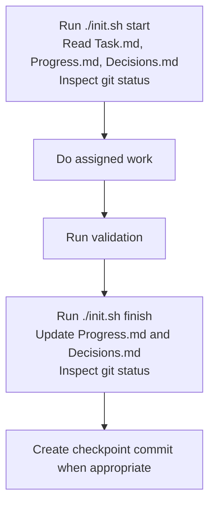

# AICUP_ESG2026

Project initialized with the standard project tree.

## Layout

- `core/service/`: business logic and pipelines
- `core/api/`: API, CLI, routes, and adapters
- `data/raw_data/`: user-provided raw data
- `data/externel_data/`: simulated or external generated data
- `lib/`: shared utilities
- `test/`: tests
- `configs/`: config files and environment templates
- `ui/`: frontend or interface code
- `exp/`: experiments and research notes
- `results/`: evaluation outputs
- `logs/`: runtime logs
- `external/`: third-party service wiring
- `docs/`: project documentation

## Agent Workflow

Use `init.sh` as the checklist for agent handoff.

```bash
./init.sh start
./init.sh finish
```


