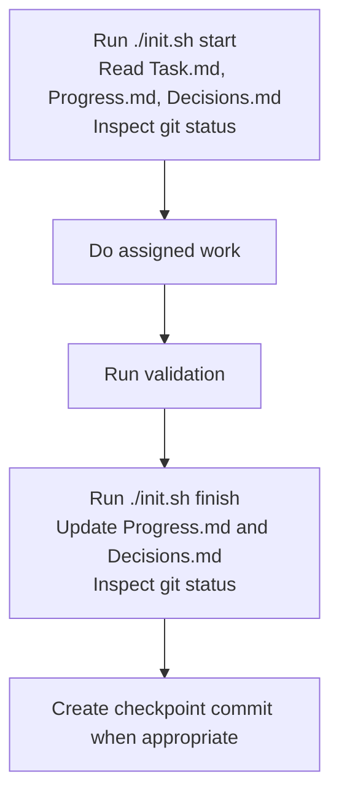

# AICUP_ESG2026


## Requiremnets
```bash
pip install -r requirements.txt
```

## Layout

- `core/service/`: business logic and pipelines
- `core/api/`: API, CLI, routes, and adapters
- `data/raw_data/`: user-provided raw data
- `data/externel_data/`: simulated or external generated data
- `data/synthesis_data/`: synthetic data
- `lib/`: shared utilities
- `test/`: tests
- `configs/`: config files and environment templates
- `ui/`: frontend or interface code
- `exp/`: experiments and research notes
- `exp/agent_loop`: the workspace agent runs experiments 
- `results/`: evaluation outputs
- `logs/`: runtime logs
- `external/`: third-party service wiring
- `docs/`: project documentation

## Architectures

stage1
bert -> gemma4

stage2
bert -> gemma4

stage3
multitaskbert

## Methodologies

要介紹 input/output

### Stage1

**Synthesis Data**


**Ensemble Data Collection**
```bash
bash scripts/data/get_ensemble_model_data_for_stage1.sh
```

**Train Ensemble Models**
```bash
bash scripts/train/train_ensemble_models_for_stage1.sh
```

**Predict**
```
bash scripts/predict/predict_ensemble_model_for_stage1.sh
```

### Stage2

**Ensemble Data Collection**
```bash
bash scripts/data/get_ensemble_model_data_for_stage2.sh
```

**Train Ensemble Models**
```bash
bash scripts/train/train_ensemble_models_for_stage2.sh
```

**Predict**
```bash
bash scripts/predict/predict_ensemble_model_for_stage2.sh
```

### Stage3
**Ensemble Data Collection**
```bash
bash scripts/data/get_multitask_model_for_stage3.sh
```

**Train Ensemble Models**
```bash
bash scripts/train/train_multitaskbert_for_stage3.sh
```

**Predict**
```bash
bash scripts/predict/predict_multitaskbert_for_stage3.sh
```

### Stage4

**Predict**
```bash
bash scripts/predict/predict_codex_for_stage4.sh
```


### Fallback Model

**Ensemble Data Collection**
```bash
bash scripts/data/get_gemma_data_for_stage12.sh
```

**Train Gemma12b**
```bash
bash scripts/train/train_gemma_for_stage12.sh
```

**Predict**
```bash
bash scripts/predict/predict_gemma_fallback_model.sh
```


## Which insights does the agent generate?

### Design Synthesis Data for Stage1
exp/agent_loop/claude/20260608T152150/loops/loops02

### Find Best Prompt for Stage4
exp/agent_loop/claude/20260609T172829/loops/loops001/


## Harness Engineering

### 設定專案規則
**AGENT.md/CLAUDE.md**
* 定義解決的任務
* 介紹資料集
* 介紹評分方式
* 限制每個 


### 設定進度檔
* init.sh
* Progress.md
* Decisions.md
* Task.md

Use `init.sh` as the checklist for agent handoff.

```bash
./init.sh start
./init.sh finish
```



### 設定工具
