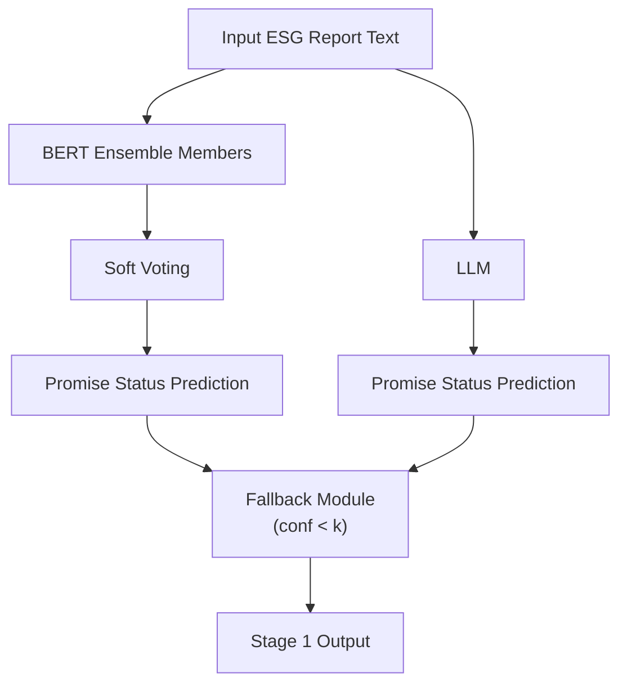
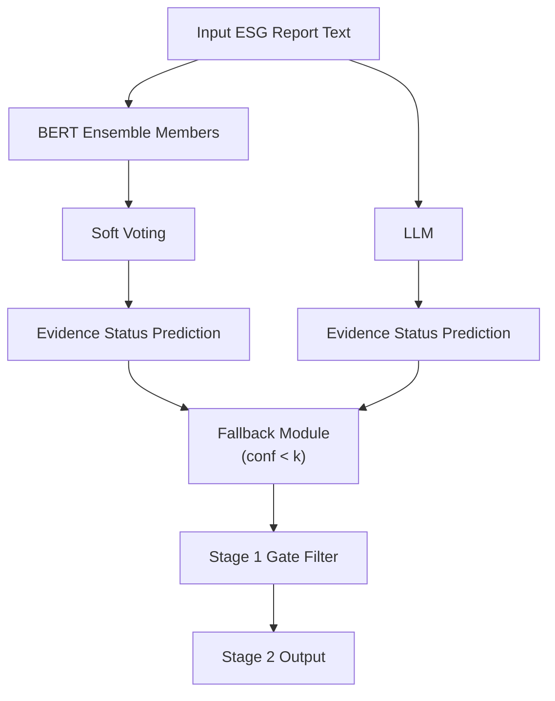
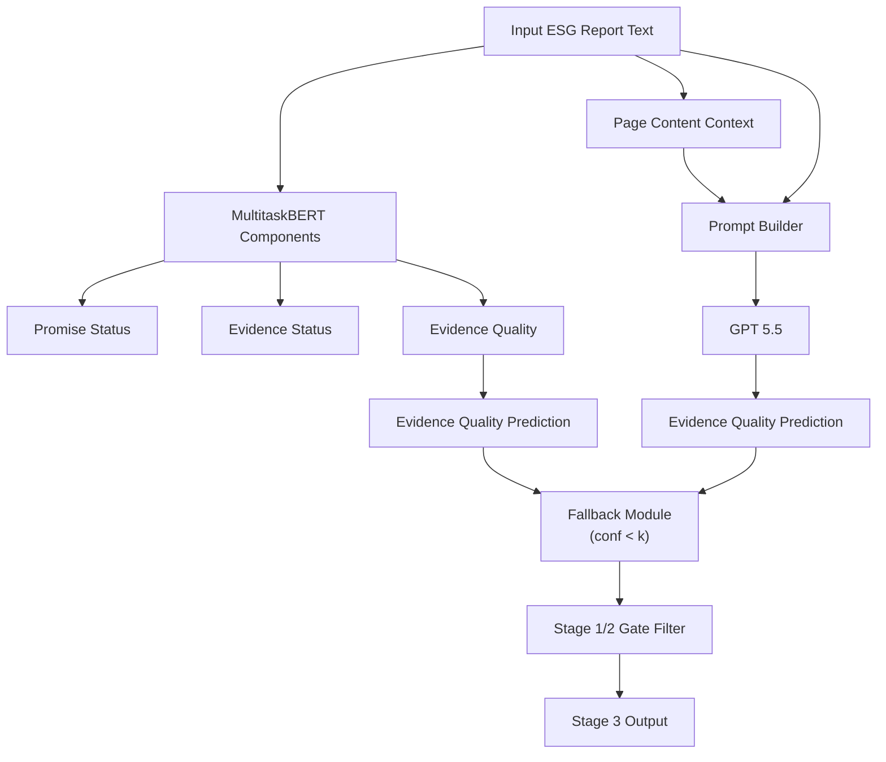
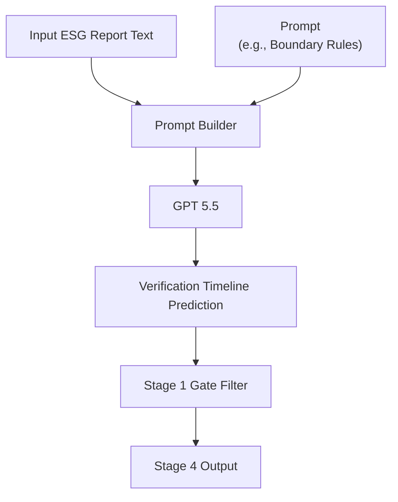
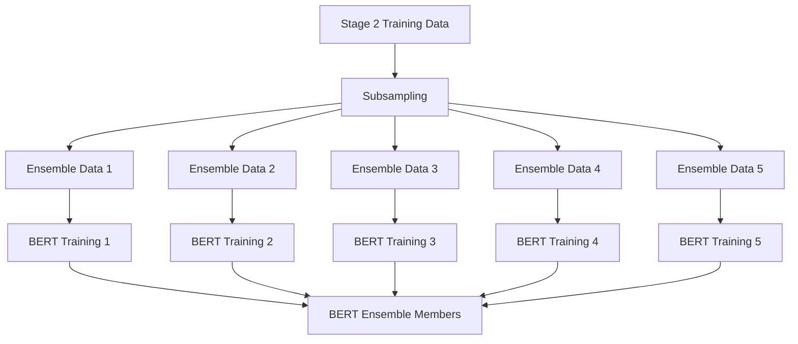
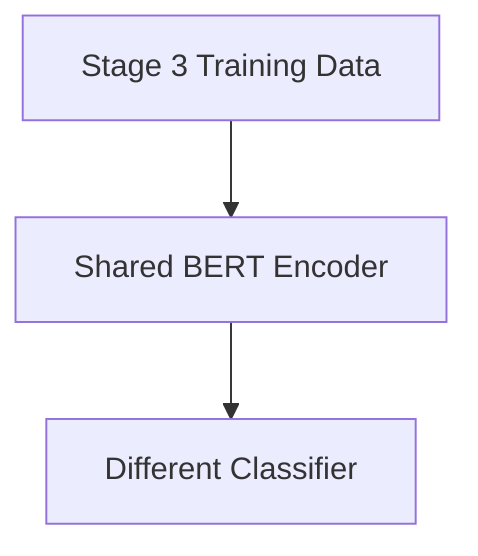
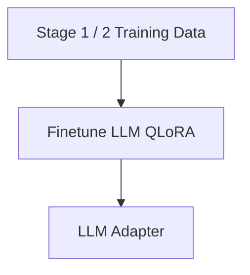
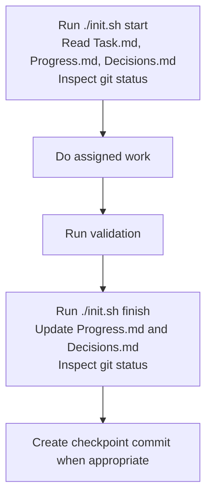

# AICUP_ESG2026


## Requirements

Use Python 3.12. From the repository root:

```bash
python -m venv .venv
source .venv/bin/activate
pip install -U pip
pip install -r requirements.txt
```

The final submission pipeline expects the prepared data under `data/` and the
submission checkpoints under `models/submission/`. These artifacts are stored in
Google Drive and can be restored with the download helper:

```bash
bash scripts/data/dowanload_data_model.sh
```

The helper uses `gdown`, which is included in `requirements.txt`. It downloads
the shared Google Drive folder, extracts the archive files, and moves the
restored artifacts into `data/` and `models/`. It refuses to run if either
`data/` or `models/` already exists, so existing local artifacts are never
overwritten.

Expected artifact sizes after following symlinks:

```bash
find -L data -type f | wc -l        # 8181
du -shL data                        # ~7.7G
du -shL models/submission           # ~17G
```

Stage 3/4 GPT fallback prediction also requires an API key in the environment:

```bash
export OPENAI_API_KEY="<your-api-key>"
```

## Directory

```text
AICUP_ESG2026/
├── core/                         # Application code
│   ├── service/                  # Business logic and pipelines
│   └── api/                      # API, CLI, routes, and adapters
├── data/                         # Project data
│   ├── raw_data/                 # User-provided raw data
│   ├── externel_data/            # External generated data
│   └── synthesis_data/           # Synthetic data
├── test/                         # Tests
├── models/                       # Model checkpoints and submission artifacts
├── configs/                      # Config files and environment templates
├── exp/                          # Experiments and research notes
│   └── agent_loop/               # Workspace agent run experiments
├── results/                      # Evaluation outputs
└── docs/                         # Project documentation
    ├── check_methodoloies/       # Check methodology notes
    └── check_submit_model_consistent/ # Submit consistency reports and supporting CSVs
```

## Architectures

### Predict

#### Stage 1



#### Stage 2



#### Stage 3



#### Stage 4



### Train

#### Stage 1


#### Stage 2



#### Stage 3



#### Fallback Model



## How to Reproduce

The submit pipeline follows the predict architecture end to end. Use the one-shot
submit wrapper when reproducing the final submission:

```bash
bash scripts/submit.sh
```

The wrapper writes all intermediate files under `results/submit/<RUN_ID>/` and
produces:

```text
results/submit/<RUN_ID>/submission.csv
```

## Detailed Methodologies

### Stage1

**Synthesis Data**

```bash
python3 core/service/data/synthesis/synthesize_st1_data_only.py
```

Default input:
- `data/raw_data/vpesg_4k_train_1000.json`

Default output:
- `results/data_synthesis/stage1/pool_a1_data_only.json`
- `results/data_synthesis/stage1/pool_a3_data_plus_promise.json`
- `results/data_synthesis/stage1/mix_a1_b1.json`, `mix_a1_b2.json`, `mix_a1_b3.json`
- `results/data_synthesis/stage1/mix_a3_b1.json`, `mix_a3_b2.json`, `mix_a3_b3.json`
- `results/data_synthesis/stage1/sampling_manifest.json`

**Materialize Frozen Training Input**

```bash
python3 core/service/data/materialize_reproduce_inputs.py --stage stage1 --output-root data --force
```

Default input:
- `data/raw_data/vpesg_4k_train_1000.json`
- `results/data_synthesis/stage1/mix_a3_b1.json`
- `data/raw_data/vpesg4k_val_1000.json`

Default output:
- `data/synthesis_data/stage1/a3_b1_add_val.json`

To avoid writing under `data/`, omit `--output-root data`; the script will write to `results/reproduce_inputs/` by default.

**Ensemble Data Collection**

```bash
bash scripts/data/get_ensemble_model_data_for_stage1.sh
```

Default input:
- `data/synthesis_data/stage1/a3_b1_add_val.json`

Default output:
- `data/ensemble_data/stage1/a3_b1_add_val/seed<S>/a3_b1_add_val.train.json`
- `data/ensemble_data/stage1/a3_b1_add_val/seed<S>/a3_b1_add_val.val.json`
- Default seeds: `42 7 123 2024 31337`

**Train Ensemble Models**

```bash
bash scripts/train/train_ensemble_models_for_stage1.sh
```

Default input:
- `data/ensemble_data/stage1/<dataset>/seed<S>/<dataset>.train.json`
- `data/ensemble_data/stage1/<dataset>/seed<S>/<dataset>.val.json`

Default output:
- `results/train/ensemble/<dataset>/seed<S>/<dataset>_focal_g3_w4_seed<S>.json`
- `results/train/ensemble/<dataset>/seed<S>/focal_g3_w4_seed<S>.log`
- `models/ensemble_models/stage1/<dataset>/seed<S>/focal_g3_w4/`

**Predict**

```bash
bash scripts/predict/predict_ensemble_model_for_stage1.sh
```

Default input:
- `data/raw_data/vpesg4k_test_2000.json`
- `models/submission/stage1/*/best_st1.pt` when `MODE=submit` (default)
- `models/ensemble_models/stage1/*/seed*/*/best_st1.pt` when `MODE=local`

Default output:
- `results/predict/stage1/ensemble/submit/softvote.csv`

### Stage2

**Synthesis Data**

```bash
python3 core/service/data/synthesis/synthesize_st2_evidence.py
```

Default input:
- Train: `data/raw_data/vpesg_4k_train_1000.json`
- Val: `data/raw_data/vpesg4k_val_1000.json`

Default output:
- `results/data_synthesis/stage2/synthetic_st2_balanced.json`
- `results/data_synthesis/stage2/mix_a2_b3.json`
- `results/data_synthesis/stage2/mix_a2_b3_add_val.json`
- `results/data_synthesis/stage2/manifest.json`

**Materialize Frozen Training Input**

```bash
python3 core/service/data/materialize_reproduce_inputs.py --stage stage2 --output-root data --force
```

Default input:
- `results/data_synthesis/stage2/mix_a2_b3_add_val.json`

Default output:
- `data/synthesis_data/stage2/mix_a2_b3_add_val.json`

To avoid writing under `data/`, omit `--output-root data`; the script will write to `results/reproduce_inputs/` by default.

**Ensemble Data Collection**

```bash
bash scripts/data/get_ensemble_model_data_for_stage2.sh
```

Default input:
- `data/synthesis_data/stage2/mix_a2_b3_add_val.json`

Default output:
- `data/ensemble_data/stage2/mix_a2_b3_add_val/seed<S>/mix_a2_b3_add_val.train.json`
- `data/ensemble_data/stage2/mix_a2_b3_add_val/seed<S>/mix_a2_b3_add_val.val.json`
- Default seeds: `42 7 123 2024 31337`

**Train Ensemble Models**

```bash
bash scripts/train/train_ensemble_models_for_stage2.sh
```

Default input:
- `data/ensemble_data/stage2/<dataset>/seed<S>/<dataset>.train.json`
- `data/ensemble_data/stage2/<dataset>/seed<S>/<dataset>.val.json`

Default output:
- `results/train/ensemble/stage2/<dataset>/seed<S>/<dataset>_ce_e5_seed<S>.json`
- `results/train/ensemble/stage2/<dataset>/seed<S>/ce_e5_seed<S>.log`
- `models/ensemble_models/stage2/<dataset>/seed<S>/ce_e5/`

**Predict**

```bash
bash scripts/predict/predict_ensemble_model_for_stage2.sh
```

Default input:
- `data/raw_data/vpesg4k_test_2000.json`
- `models/submission/stage2/*/best_st2.pt` when `MODE=submit` (default)
- `models/ensemble_models/stage2/*/seed*/*/best_st2.pt` when `MODE=local`

Default output:
- `results/predict/stage2/ensemble/submit/softvote.csv`

### Stage3

**Materialize Frozen Training Input**

```bash
python3 core/service/data/materialize_reproduce_inputs.py --stage stage3 --output-root data --force
```

Default input:
- `data/raw_data/vpesg_4k_train_1000.json`
- `data/raw_data/vpesg4k_val_1000.json`

Default output:
- `data/synthesis_data/stage3/vpesg_4k_train_1000_add_val.json`

To avoid writing under `data/`, omit `--output-root data`; the script will write to `results/reproduce_inputs/` by default.

**Ensemble Data Collection**

```bash
bash scripts/data/get_multitask_model_for_stage3.sh
```

Default input:
- `data/synthesis_data/stage3/vpesg_4k_train_1000_add_val.json`

Default output:
- `data/multitask_data/stage3/vpesg_4k_train_1000_add_val/vpesg_4k_train_1000_add_val.train.json`
- `data/multitask_data/stage3/vpesg_4k_train_1000_add_val/vpesg_4k_train_1000_add_val.val.json`

**Train Ensemble Models**

```bash
bash scripts/train/train_multitaskbert_for_stage3.sh
```

Default input:
- `data/multitask_data/stage3/vpesg_4k_train_1000_add_val/vpesg_4k_train_1000_add_val.train.json`
- `data/multitask_data/stage3/vpesg_4k_train_1000_add_val/vpesg_4k_train_1000_add_val.val.json`

Default output:
- `results/train/multitaskbert/stage3/vpesg_4k_train_1000_add_val/mt_st123_w1_8_30_mlval_seed42_e10.json`
- `results/train/multitaskbert/stage3/vpesg_4k_train_1000_add_val/mt_st123_w1_8_30_mlval_seed42_e10.log`
- `models/multitaskbert/stage3/vpesg_4k_train_1000_add_val/mt_st123_w1_8_30_mlval_seed42_e10/`

**Predict**

```bash
bash scripts/predict/predict_multitaskbert_for_stage3.sh
bash scripts/predict/predict_gpt_fallback_for_stage3.sh
```

Default input for `predict_multitaskbert_for_stage3.sh`:
- `data/raw_data/vpesg4k_test_2000.json`
- `models/submission/stage3/w0_2_0_3_0_5/best_multitask_st3.pt` when `MODE=submit` (default)
- `models/multitaskbert/stage3/vpesg_4k_train_1000_add_val/mt_st123_w1_8_30_mlval_seed42_e10/best_multitask_st3.pt` when `MODE=local`

Default output for `predict_multitaskbert_for_stage3.sh`:
- `results/predict/stage3/multitaskbert/submit/prediction.csv`

Default input for `predict_gpt_fallback_for_stage3.sh`:
- `data/raw_data/vpesg4k_test_2000.json`
- `configs/prompts/stage3/add-context.txt`
- `data/generated/raw_doc_table.jsonl`
- `data/generated/raw_page_table.jsonl`
- `data/generated/stage3_offsets.jsonl`

Default output for `predict_gpt_fallback_for_stage3.sh`:
- `results/predict/stage3/gpt_fallback/codex/add_context_test2000_codex.csv`
- `logs/predict/stage3/gpt_fallback/add_context_test2000_codex.log`
- `results/predict/stage3/gpt_fallback/codex/add_context_test2000_codex.csv.cache.jsonl`

### Stage4

**Predict**

```bash
bash scripts/predict/predict_codex_for_stage4.sh
```

Default input:
- `data/raw_data/vpesg4k_test_2000.json`
- `configs/prompts/stage4/boundary_rules_v4.txt`

Default output:
- `results/predict/stage4/codex/all_rows/<RUN_ID>/stage4_codex_predictions.csv`
- `results/predict/stage4/codex/all_rows/<RUN_ID>/raw/`
- `results/predict/stage4/codex/all_rows/<RUN_ID>/token_usage.jsonl`

### Fallback Model: Gemma4

**Materialize Frozen Training Input**

```bash
python3 core/service/data/materialize_reproduce_inputs.py --stage stage12 --output-root data --force
```

Default input:
- `data/raw_data/vpesg_4k_train_1000.json`
- `data/raw_data/vpesg4k_val_1000.json`

Default output:
- `data/synthesis_data/stage12/vpesg4k_train_val_mix_2000.json`

To avoid writing under `data/`, omit `--output-root data`; the script will write to `results/reproduce_inputs/` by default.

**Ensemble Data Collection**

```bash
bash scripts/data/get_gemma_data_for_stage12.sh
```

Default input:
- All `*.json` files under `data/synthesis_data/stage12/`

Default output:
- `data/gemma_data/stage12/<dataset>.train.json`
- `data/gemma_data/stage12/<dataset>.val.json`

**Train Gemma12b**

```bash
bash scripts/train/train_gemma_for_stage12.sh
```

Default input:
- Config: `configs/train/gemma4_st12_mix.yml`
- Base model: `models/gemma/base/unsloth-gemma-4-12b`
- Train split: `data/gemma_data/stage12/vpesg4k_train_val_mix_2000.train.json`
- Val split: `data/gemma_data/stage12/vpesg4k_train_val_mix_2000.val.json`

Default output:
- Adapter: `models/gemma/gemma4_st12_mix`
- Log: `logs/train/gemma/stage12/train.log`

**Predict**

```bash
bash scripts/predict/predict_gemma_fallback_model.sh
```

Default input:
- `data/raw_data/vpesg4k_test_2000.json`
- Base model: `models/gemma/base/unsloth-gemma-4-12b`
- Adapter: `models/gemma/gemma4_st12_mix` when `MODE=local` (default)
- Adapter: `models/submission/st12_fallback/gemma4_st12_mix` when `MODE=submit`

Default output:
- `results/predict/gemma/local/stage1/gemma.csv`
- `results/predict/gemma/local/stage2/gemma.csv`

### Fallback Model: GPT5.5

**Predict**

```bash
bash scripts/predict/predict_gpt_fallback_for_stage3.sh
```

Default input:
- `data/raw_data/vpesg4k_test_2000.json`
- `configs/prompts/stage3/add-context.txt`
- `data/generated/raw_doc_table.jsonl`
- `data/generated/raw_page_table.jsonl`
- `data/generated/stage3_offsets.jsonl`

Default output:
- `results/predict/stage3/gpt_fallback/codex/add_context_test2000_codex.csv`
- `logs/predict/stage3/gpt_fallback/add_context_test2000_codex.log`

## Which insights does the agent generate?

The agent-loop runs are used as a structured research layer around the main
training and prediction pipeline. Each run records what was tried, why it was
tried, what changed in the code or prompt, and whether the result should be
kept, rejected, or used as a follow-up hypothesis.

### Stage 1 Synthesis Data Design

Artifact:
- `exp/agent_loop/claude/20260608T152150/loops/loops02`

Insights generated:
- Which synthetic data variants are useful for Stage 1 promise detection.
- Which label patterns are underrepresented in the raw training data.
- Whether synthetic examples should be data-only, data-plus-promise, or mixed.
- Which generated pools should be frozen into reproducible training inputs.
- Which failure cases are caused by vague corporate statements versus explicit
  future commitments.

The result is not just a new dataset. The useful output is the decision record:
which synthesis recipe is worth keeping, which examples should be filtered, and
which downstream command should consume the frozen data.

### Stage 4 Prompt Selection

Artifact:
- `exp/agent_loop/claude/20260609T172829/loops/loops001/`

Insights generated:
- Which boundary rules reduce timeline label confusion.
- Which prompt phrasing makes the model distinguish `already`,
  `within_2_years`, `between_2_and_5_years`, and `more_than_5_years`.
- Which errors are caused by missing date cues, implicit goals, or Stage 1 gate
  failures.
- Which prompt version should be promoted into `configs/prompts/stage4/`.
- Which examples should become regression checks before changing prompts again.

The agent loop turns prompt iteration into an auditable experiment: each prompt
change has an input set, output artifact, observed error pattern, and promotion
decision.


## Harness Engineering

Harness engineering is the project infrastructure that keeps agent work
repeatable. It defines where files may be placed, how agents receive tasks, how
progress is recorded, and how outputs are validated before they are promoted.

### Project Rules

Primary files:
- `AGENT.md`
- `CLAUDE.md`
- `docs/file_tree_spec.md`

These files define the operating contract for agents:
- The task definition for the four ESG stages.
- The allowed data-use rule: model inputs must be derived from the raw `data`
  field unless the user explicitly changes the problem definition.
- The dataset description and expected output labels.
- The metric focus for each stage.
- File placement rules, including that implementation code belongs in
  `core/service/` or `core/api/`, while generated artifacts should go under
  `results/` by default.
- Safety rules that prevent accidental commits of generated data, logs, model
  weights, or temporary experiment outputs.

### State And Handoff Files

Primary files:
- `init.sh`
- `Progress.md`
- `Decisions.md`
- `Task.md`

These files make agent work resumable:
- `Task.md` is the human instruction inbox and priority queue.
- `Progress.md` records current status, completed work, active work, known
  issues, and next subtasks.
- `Decisions.md` records durable choices with rationale and impact.
- `init.sh` provides a start/finish checklist so every run reads the same state
  files and updates the same handoff files.

Use `init.sh` as the checklist for agent handoff.

```bash
./init.sh start
./init.sh finish
```



### Validation Harness

The harness also standardizes how outputs are checked:
- Reproduce commands in this README list the expected input and output path for
  each stage.
- Consistency reports under `docs/check/check_submit_model_consistent/` compare
  submit artifacts against generated prediction outputs.
- Methodology notes under `docs/check/check_methodoloies/` explain how each
  check should be reproduced.
- Data materialization defaults to `results/reproduce_inputs/` unless
  `--output-root data` is explicitly requested, reducing the chance of
  accidentally staging generated data.

### Tooling

The project keeps scripts as thin orchestration wrappers and puts Python
implementation code under `core/service/`. This keeps the execution surface
clear:
- `scripts/data/` prepares training inputs by calling service code or wrappers.
- `scripts/train/` launches model training with fixed defaults.
- `scripts/predict/` launches prediction jobs and writes outputs under
  `results/predict/`.
- `core/service/` contains the reusable logic that can be tested, imported, or
  called by wrappers.

This separation makes it easier for agents to change implementation details
without breaking the documented command interface.
